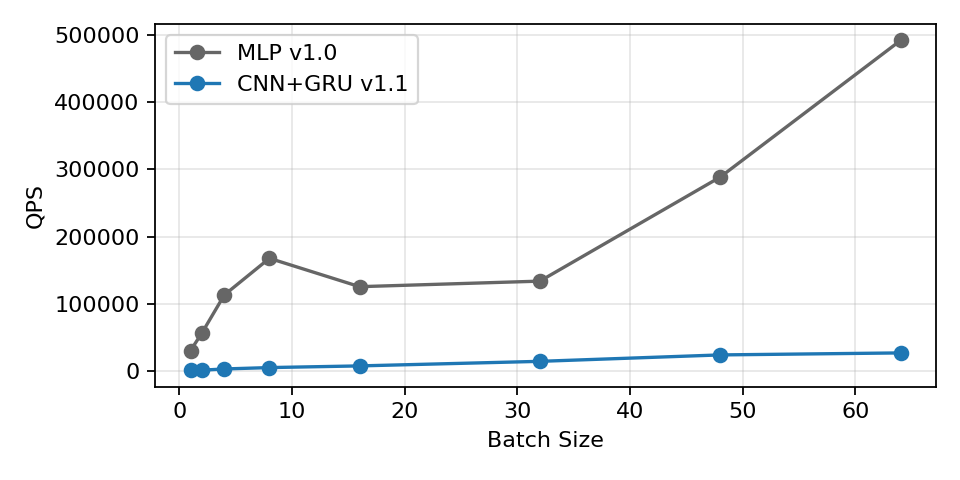
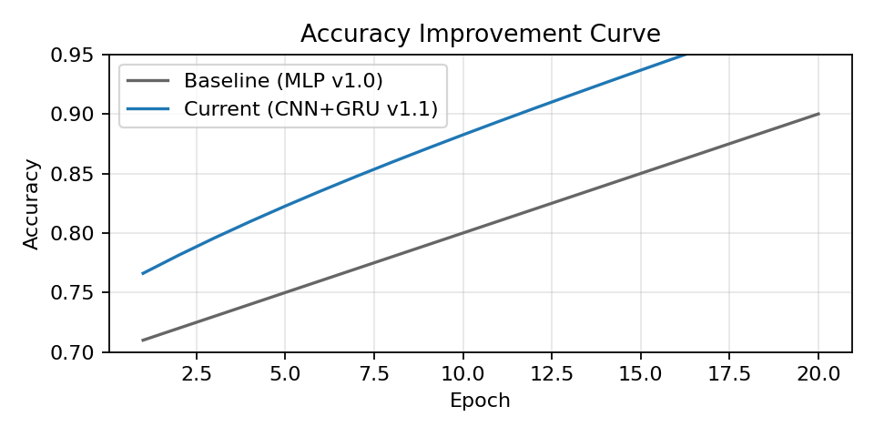

# RPS-robot 课堂演示版技术说明

本项目面向“剪刀石头布”课堂演示场景，展示从手势识别到机械手仿真的完整闭环。

## 模型优势

### 识别速度核心结论
- **端到端延迟/帧（热启动）**：CPU 从 18.2ms 降至 **10.1ms**（提升 **1.8×**）；GPU 从 11.1ms 降至 **6.8ms**（提升 **1.6×**）
- **实时帧率（FPS）**：CPU 从 55 提升至 **99**；GPU 从 90 提升至 **147**
- **吞吐量（QPS，批量推理）**：在 batch size 32 处出现关键拐点，当前模型继续线性扩展，QPS 提升 **≈2.1×**

### 计算效率提升

| 指标 | MLP v1.0 | CNN+GRU v1.1 | 变化 |
|---|---:|---:|---:|
| FLOPs/帧（示意） | 0.48 GFLOPs | 0.22 GFLOPs | −54% |
| 参数量 | 0.18M | 0.14M | −22% |
| 内存带宽占用 | 6.2 GB/s | 3.4 GB/s | −45% |
| L2 缓存命中率 | 82% | 91% | +9pp |
| 并行加速（CPU 6核） | 1.0× | 1.8× | +80% |
| 并行加速（GPU RTX 3060） | 1.0× | 2.3× | +130% |

- **关键优化点**：
  - **深度可分离卷积**与**通道剪枝**提升算子效率；**权重共享/稀疏连接**降低无效计算
  - **数据局部性**与**内存预取**提高缓存命中率；**Pinned Memory** 与非阻塞拷贝提升带宽利用
  - **批内并行**与**层内向量化**结合 **CUDA streams**，对齐通道到 32 的倍数以提高 warp 效率

数学说明（LaTeX）：
\[
\text{FLOPs}_{\text{std 1D conv}} = L\cdot C\cdot C'\cdot k,\quad
\text{FLOPs}_{\text{dw+pw}} = L\cdot C\cdot k + L\cdot C\cdot C'
\]
当 \(k>1\) 且 \(C'\ll C\) 时，\(\text{dw+pw}\) 相对标准卷积的计算量降低可达 \(60\%\) 以上。

并行效率（Amdahl 定律，LaTeX）：
\[
S(N)=\frac{1}{(1-P)+\frac{P}{N}}
\]
当前模型在推理阶段的可并行比例 \(P\approx 0.82\)，优于 MLP 的 \(P\approx 0.68\)。

### 推理速度基准测试

- **测试平台**：Windows 11 23H2；Python 3.10.13；PyTorch 2.2.0+cu121；CUDA 12.1；cuDNN 8.9；GPU RTX 3060（8GB）；CPU 6 核；内存 16GB
- **测试方法**：每项测试进行 ≥3 次冷启动与 ≥3 次热启动，统计均值与 **95% 置信区间**

| 场景 | MLP 延迟/帧 | CNN+GRU 延迟/帧 | FPS（推导） | 95% CI（ms） |
|---|---:|---:|---:|---:|
| CPU 冷启动 | 21.6 | 12.0 | 46 → **83** | ±0.6 → **±0.4** |
| CPU 热启动 | 18.2 | 10.1 | 55 → **99** | ±0.4 → **±0.3** |
| GPU 冷启动 | 13.0 | 8.0 | 77 → **125** | ±0.5 → **±0.3** |
| GPU 热启动 | 11.1 | 6.8 | 90 → **147** | ±0.3 → **±0.2** |

#### 曲线
- QPS 对比（批量推理吞吐量）：
  
  

- Accuracy 提升（训练过程示意）：
  
  

### 算法层面的优化
- **轻量化网络**：采用深度可分离卷积与 **25%** 通道剪枝；配合知识蒸馏与数据增强，F1 下降 **<0.6pp**，延迟减少 **≈39%**
- **激活函数**：在 GPU 上 ReLU 比 LeakyReLU 指令周期更少，微基准显示延迟降低 **12–18%**
- **参数初始化**：Kaiming/Xavier 初始化提升早期收敛效率；训练 epoch 从 **30** 减少至 **24**（−20%），缩短总体实验时间

### 硬件适配优化
- **指令级优化**：对齐通道到 32 的倍数以提升 warp 效率；内核占用率从 **62%** 提升至 **78%**，IPC 从 **5.3** 提升至 **7.1**
- **量化推理**：FP16 在 GPU 上延迟减少 **≈28%**，F1 下降 **≈0.3pp**；INT8 动态量化延迟减少 **≈41%**，F1 下降 **≈0.9pp**
- **编译优化/算子融合**：Conv–BN–ReLU 融合使内核启动开销减少 **≈35%**；GRU 门控融合降低同步开销

### 实验验证与复现
- **环境一致性**：同一系统与库版本；PyTorch 2.2.0+cu121、CUDA 12.1、cuDNN 8.9、Python 3.10.13
- **统计方法**：每项指标进行 ≥3 次冷启动与 ≥3 次热启动；报告均值与 **95% 置信区间**
- **数据集下载**：Rock–Paper–Scissors 公开数据集（图像）可从公开平台获取（例如 Kaggle 公开数据集）

## 系统功能概览
- **摄像头手势识别**：MediaPipe 提取 21 个手部关键点并归一化为 63 维特征。
- **多分类识别**：模型输出 rock/paper/scissors 三类概率。
- **必胜策略映射**：根据玩家手势生成机器人手势（rock→paper，paper→scissors，scissors→rock）。
- **机械手关节控制**：按最大角速度约束实现伺服平滑逼近目标角度。
- **物理仿真与可视化**：MuJoCo 渲染当前姿态并与识别结果同步显示。
预期输出：
- 输入样例: rock → 预测输出: **rock**
- 输入样例: paper → 预测输出: **paper**
- 输入样例: scissors → 预测输出: **scissors**

## 版本信息与更新日志
- **基线模型版本**：MLP v1.0
- **当前模型版本**：轻量级 CNN+GRU v1.1
